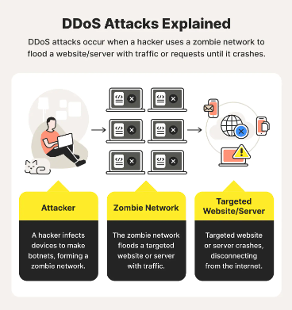

# DDOS-Gotta-Deny-That-Service-Sorry
<h3 align="left">What is a DDOS attack ? </h3>
### Warning : !!! DO NOT USE THIS SCRIPT FOR HARMFUL ACTIVITIES , It is important to prioritize ethical considerations and adhere to legal and responsible use of technology !!!.
A DDoS attack targets websites and servers by disrupting network services in an attempt to exhaust an application’s resources. The perpetrators behind these attacks flood a site with errant traffic, resulting in poor website functionality or knocking it offline altogether. These types of attacks are on the rise.

DDoS attacks are wide-reaching, targeting all sorts of industries and company sizes worldwide. Certain industries, such as gaming, ecommerce, and telecommunications, are targeted more than others. DDoS attacks are some of the most common cyberthreats, and they can potentially compromise your business, online security, sales, and reputation.

<h3 align="left">How does DDOS attack work ? </h3>

   
